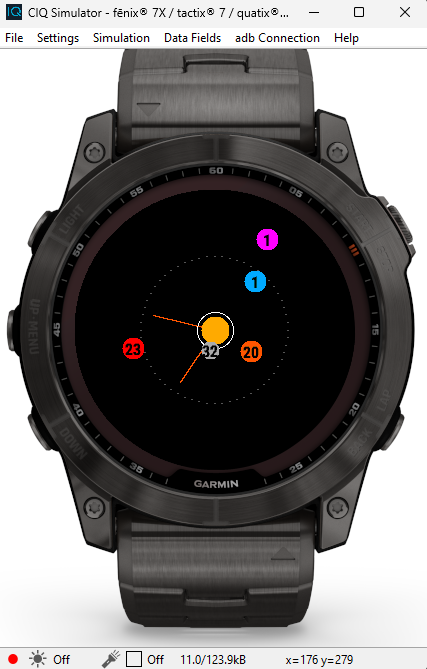
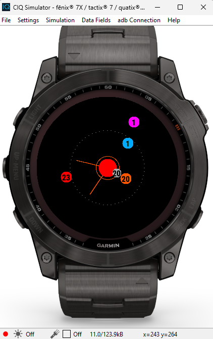
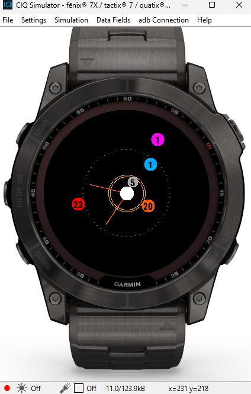
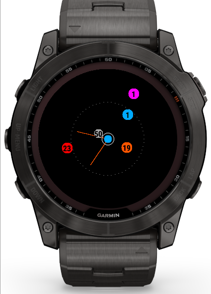
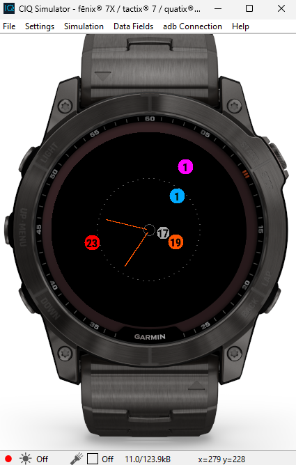

# Planetary Garmin Watchface
Emulates our solar system according to your current time.

## Permissions
* Requires position permission to draw Sun event lines.

## Orbital Bodies
* Sol
  - Battery
    - 75%+ = main sequence
    - 50%+ = red giant
    - 40%+ = collapsed nebula
    - 15%+ = white dwarf
    - 0+ = fading
  - Sunrise / Sunset (indicated by 2 lines drawn from star)
* Mercury = second
* Venus = minute
* Terra = hour
* Mars = day / day of week (position is divided in 7 positions according to the current day of week)
* Jupiter = month (position is divided in 12 according to the current month)

## State Previews
### Batt > 75%
  
### Batt > 50%
  
### Batt > 40%
  
### Batt > 15%
  
### Batt > 0%
  
